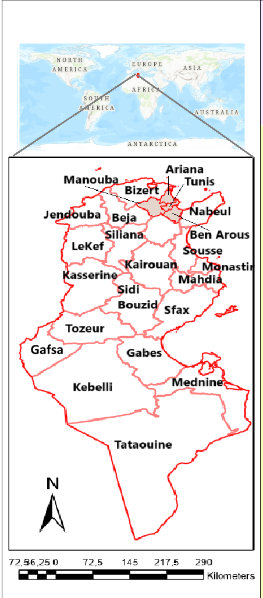
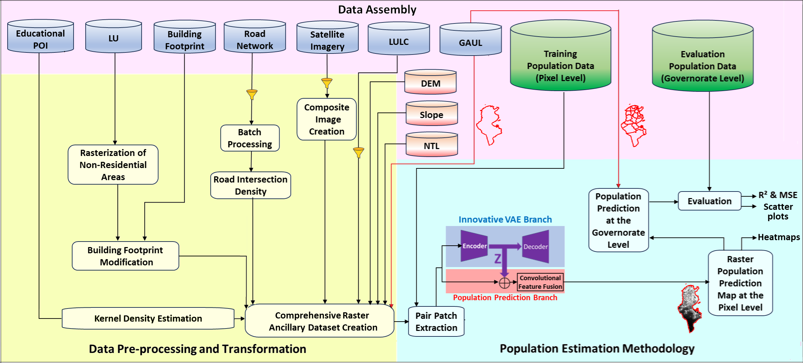

# popVAT: Population Mapping using Variational Autoencoder with Transfer Learning

## 1. Introduction

This repository provides the implementation of **popVAT**, an extension of the **popVAE** framework for high-resolution population mapping.  
popVAT uses the **same datasets as popVAE**, while the **deep learning model is modified** to improve performance.

The overall workflow and the location of the study area (**Tunisia**) are illustrated in **Figure 1-a of popVAE**:

---

# 2. Dataset

This section explains the **data assembly, preprocessing and transformation workflow** used in the study.  
The full workflow is illustrated in **Figure 1 of popVAT**:

The dataset consists of **population data** and several **ancillary datasets**.

---

# 2.1 Population Data

Four population datasets were used:

- WorldPop  
- GPWv4  
- LandScan  
- INS (Institut National de la Statistique – Tunisia)

Original sources:

- WorldPop: https://hub.worldpop.org/doi/10.5258/soton/wp00536
- GPWv4: https://www.earthdata.nasa.gov/data/catalog/sedac-ciesin-sedac-gpwv4-popdens-r11-4.11
- LandScan: https://landscan.ornl.gov/ 
- INS: https://www.ins.tn/statistiques/111

Because some of these datasets require downloading **global rasters and extracting Tunisia**, we provide ready-to-use files.

Folder:

Population Data/

Files:

worldpop.tif  
gpwv4.tif  
landscan.tif  
INS.xls  

Users can either download the original datasets or directly use the provided files.

---

# 2.2 Ancillary Data

## 2.2.1 Educational POI

Educational POIs include:

- Schools  
- Preparatory schools  
- Institutes  

The original tabular dataset download link is provided in the repository.

Because the source platform continuously updates the dataset (overwriting old versions),  
the exact version used in this study is also provided:

POI.xls

### Processing Steps (ArcGIS Pro)

1. Import the tabular dataset.
2. Convert the table to **point vector data**.
3. Separate features into:
   - Schools
   - Preparatory schools
   - Institutes
4. Apply **Kernel Density Estimation (KDE)**.

Parameters used:

Search radius (bandwidth): 5 km  
Method: Planar  
Area units: Square kilometers  

Shapefiles are available in:

Educational POI/

Final dataset:

POI.tif

---

# 2.2.3 Land Use (LU)

Land Use data were extracted from **OpenStreetMap (OSM)**.

Download via HOT Export Tool:

https://export.hotosm.org/

LU data used in the study (lines shapefile) are provided in:

LU/

Rasterization of non-residential areas instructions are provided in the same folder.

---

# 2.2.4 Building Footprint

Original dataset:

WSF2019  
https://download.geoservice.dlr.de/WSF2019/

Since the dataset is distributed as tiles, we provide the assembled Tunisia file:

WSF2019.tif

### Processing

1. WSF2019 was checked against the **non-residential binary mask**.
2. Building heights from WSF 3D were used.
3. Heights were reclassified:

Number of floors = pixel height / 3 meters

4. Floors were multiplied with the checked WSF2019 dataset.

Detailed steps are provided in:

Building Foot print/

Intermediate and final files:

non_residential_buildings0or1.tif  
Tunisia_floor_WSF2019_WGS_84_32N_0to1.tif  
Tunisia_floor_WSF2019_WGS_84_32N_0to1_residentiel.tif  

Final dataset used in the study:

Tunisia_floor_WSF2019_WGS_84_32N_0to1_residentiel.tif

---

# 2.2.5 Road Network

Road network data were extracted from **OpenStreetMap (OSM)**.

Processing:

1. Major roads were selected (excluding residential and service roads).
2. Batch Processing tool was used to snap road segments.
3. Intersect tool identified intersection points.
4. Point Density tool generated the raster layer.

Data used in the study are provided in:

Road Network/

Final dataset:

road.tif

---

# 2.2.6 Satellite Imagery

Satellite imagery was obtained using **Google Earth Engine**.

Detailed workflow is provided in:

Satellite Imagery/

Final dataset:

MODIS.tif

---

# 2.2.7 LULC

LULC data were also obtained using **Google Earth Engine**.

Details are available in:

Satellite Imagery/

Final dataset:

LULC.tif

---

# 2.2.8 GAUL

Administrative boundaries were obtained using **Google Earth Engine**.

Processing:

Each governorate boundary shapefile was converted to raster with:

Width: 3807  
Height: 8116  

Pixel values:

Inside boundary = 1  
Outside boundary = 0

Files are provided in:

Tunisia_Regions/

---

# 2.2.9 DEM and Slope

Datasets obtained using **Google Earth Engine**.

Processing details:

DEM and Slope/

Final datasets:

dem.tif  
slope.tif

---

# 2.2.11 NTL

Nighttime light data were obtained using **Google Earth Engine**.

Details:

NTL/

Final dataset:

NTL.tif

---

# 2.3 Final Dataset

After downloading and preprocessing all datasets, users can reproduce the dataset used in this study.

For convenience, the final dataset is also provided:

tunisia10.tif

Characteristics:

- Original 12 bands
- Educational POIs merged into one layer
- Final dataset contains **10 bands**

---

# 3. popVAT Architecture

The popVAT architecture extends popVAE with a modified deep learning model.

Architecture diagram:

Figure_2_popVAT.png

Detailed explanation:

Model architecture of popVAT/

---

# 4. Training

Training scripts and configuration files are provided in:

Model training of popVAT/

This includes:

- Hyperparameters  
- Model configuration  
- Training procedure  

---

# 5. Evaluation

Evaluation scripts and metrics are provided in:

Evaluation of popVAT/

Includes:

- Testing procedure  
- Metrics  
- Result generation  

---

# Reproducibility

Steps to reproduce the study:

1. Download datasets or use the provided ones.
2. Follow preprocessing instructions inside each folder.
3. Assemble the final dataset.
4. Train the model using provided scripts.
5. Run the evaluation scripts.

All intermediate and final datasets are provided whenever possible to ensure reproducibility.

---

# Citation

If you use this repository, please cite the corresponding publications of **popVAT** and **popVAE**.

---

# License

Specify the license used for this repository.
