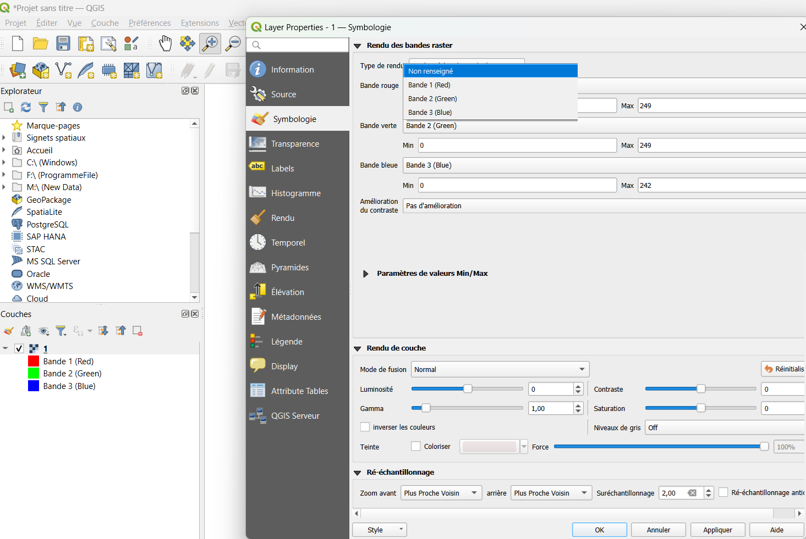
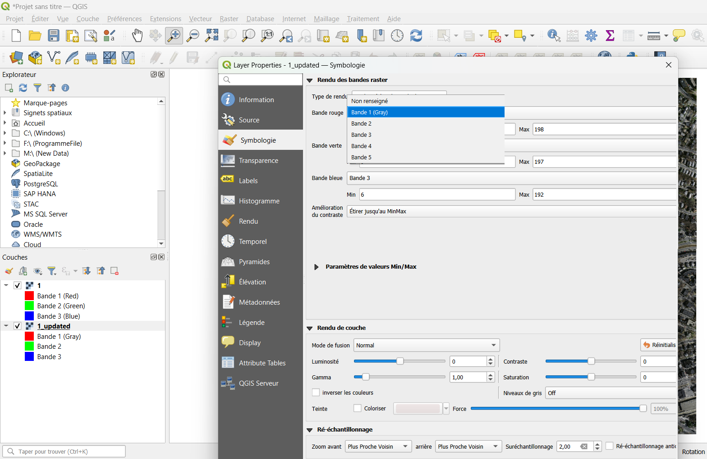

> **ℹ️ Note:** This repository provides a **quick test harness** for the pretrained **popVAT_Building** model.  
> It is intended for **fast experimentation on small sample GeoTIFFs**.
>
> **To reproduce the full workflow from raw data, follow the pipeline below:**
>
> ```
> ArcGIS (generate mosaic shapefile)
>        ↓
> Google Earth Engine (compute DEM & Slope)
>        ↓
> ArcGIS (project, resample, and add DEM/Slope bands to RGB tiles)
>        ↓
> Training
>        ↓
> Run Prediction
>        ↓
> Apply Threshold
>        ↓
> Apply Colorization
> ```
>
> **However, if you only want to test the model or perform building segmentation, you can skip all preprocessing and training steps and directly use the provided pretrained model for inference.**

This repository provides a **lightweight test harness** for the pretrained **popVAT_Building** model to segment **buildings** on updated test images that combine **RGB + DEM + Slope** layers (5 bands).  
The two provided test images (**1.tif** and **2.tif**) are extracted from the **test partition of the Massachusetts Buildings Dataset** and have been extended with DEM and slope channels for evaluation.  

Although the preprocessing workflow in this repository was originally performed using **ArcGIS** (commercial software requiring a paid license), the visualization of the final preprocessing outputs can also be performed using the free and open-source **QGIS** software.  
A detailed explanation of the QGIS visualization workflow is provided in the following sections.

---

## 📦 Requirements

- Python 3.8+
- TensorFlow
- numpy
- rasterio
Install dependencies:

    pip install -r requirements.txt

Create `requirements.txt`:

    tensorflow==2.15.0
    numpy
    rasterio

---

## 📂 Repository Structure

    popVAT_Building-Test/
    │── README.md
    │── TriFusion_Gate_Atrous_Gate.py   # Model definition
    │── predict.py                       # Run inference on all GeoTIFFs in test_dem/
    │── threshold.py                     # Apply threshold to probability maps
    │
    │
    ├── test_updated/                        # UPDATED test GeoTIFFs (5 bands: R,G,B,DEM,Slope)
    │   ├── 1_updated.tif
    │   └── 2_updated.tif
    │
    └── test/                            # ORIGINAL test GeoTIFFs (reference RGB)
        ├── 1.tif
        └── 2.tif

**Input format**: GeoTIFFs with **5 bands** ordered as **[R, G, B, DEM, Slope]**.

---

## 🚀 Quick Start

### 1) Run Prediction (probability maps)
Runs on **all `.tif` files inside `test_updated/`** and writes per-pixel building probabilities (0–1) to `output/`.

    python predict.py

This creates:

    output/
      ├── 1_updated.tif    # float32, values in [0,1]
      └── 2_updated.tif

**Color meaning (for visualization):**
- 0.0 → **black** (non-building)
- 1.0 → **white** (building)
- (0.0–1.0) → **grayscale** probability

---

### 2) Apply Threshold (binary masks)
Converts probability maps to **binary** masks using a user-defined threshold (e.g., 0.50). The result contains **white (1)** for building and **black (0)** for background.

    python threshold.py --threshold 0.9

This creates:

    output_threshold_0.9/
      ├── updated_1.tif    # uint8 or bool, {0,1}
      └── updated_2.tif

> You can repeat with different thresholds. A new folder named `output_threshold_X.XX/` is created each time.

---

## 🛰️ Visualizing in QGIS
You can use free QGIS to inspect both the original and updated test rasters.
Download QGIS (Windows):
    https://download.osgeo.org/qgis/windows/QGIS-OSGeo4W-3.44.2-1.msi?US
1. Open **QGIS**.
2. Drag the files from `output/` (probabilities) or `output_threshold_X.XX/` (binary) into the **Layers** panel in QGIS, **or simply open them with Paint/Image Viewer for a quick check**.
3. Add corresponding originals from `test/` or updated inputs from `test_updated/` for overlay comparison.


Right-click the raster layer and open Properties → Information (Figure 1).

**Figure 1.** Raster properties window  

The original Massachusetts test image contains only 3 bands (RGB) (Figure 2).

**Figure 2.** Original Massachusetts test image (3 bands: RGB)  

The updated test image contains 5 bands (RGB + DEM + Slope) (Figure 3).

**Figure 3.** Updated test image (5 bands: RGB + DEM + Slope)  


This confirms that the updated dataset properly includes the elevation and slope layers in addition to RGB.
---

## ℹ️ Notes & Tips

- **Band order matters**: inputs in `test_updated/` must be **[R, G, B, DEM, Slope]**.
- **Value ranges**: probabilities are written in **[0,1]**. Binary masks are **{0,1}**.
- **Performance**: large tiles benefit from running on a machine with sufficient RAM/VRAM; consider tiling if needed.

---

