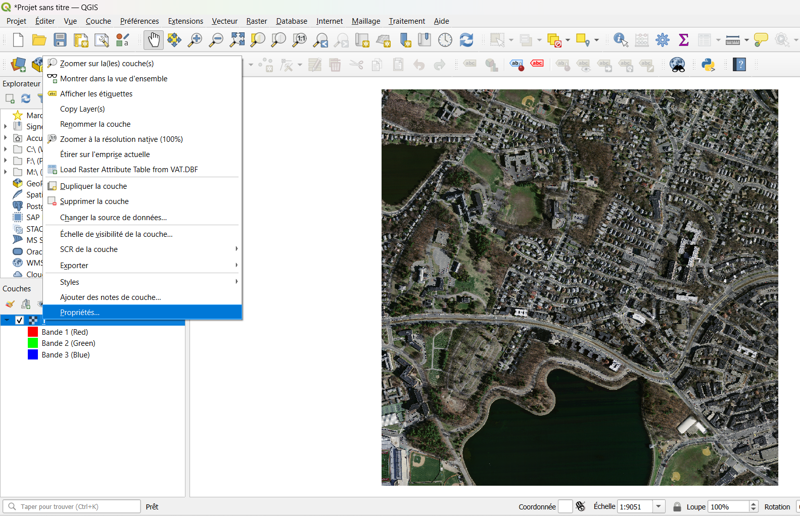
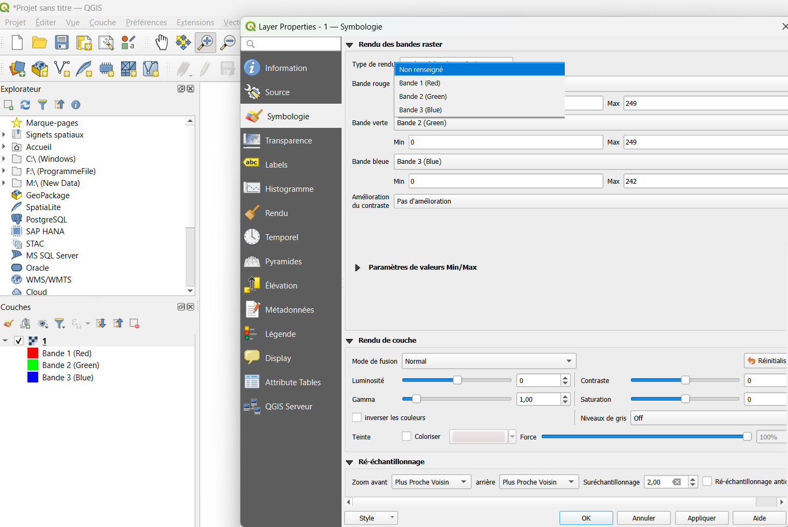
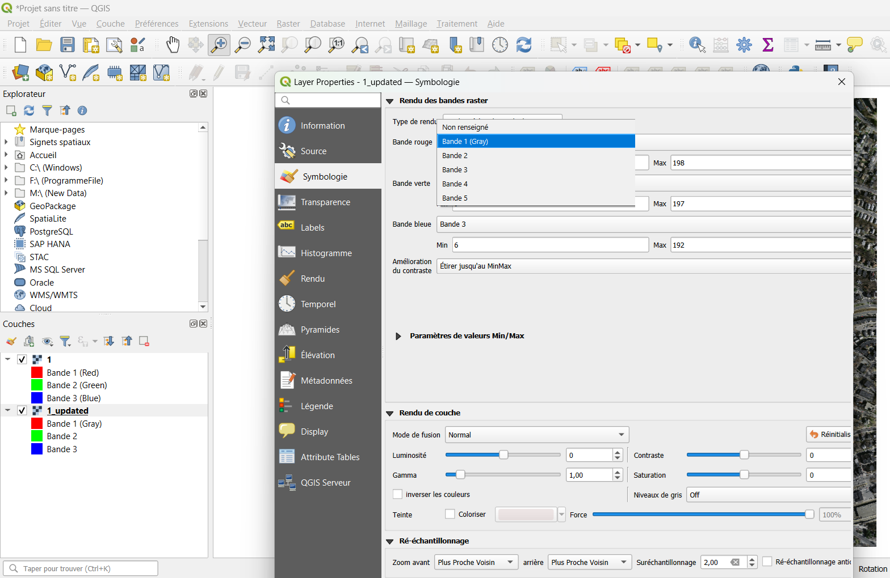

# popVAT_Building-Test

> **ℹ️ Note:** This repository provides a **quick test harness** for the pretrained **popVAT_Building** model.  
> It is intended for **fast experimentation on small sample GeoTIFFs**.
>
> **To reproduce the full workflow from raw data, follow the pipeline below:**
>
> ```text
> ArcGIS (generate mosaic shapefile)
>        ↓
> Google Earth Engine (compute DEM & Slope)
>        ↓
> ArcGIS (project, resample, and add DEM/Slope bands to RGB tiles)
>        ↓
>    Training
>        ↓
>  Run Prediction
>        ↓
> Apply Threshold
>        ↓
> Apply Colorization
>        ↓
> Overlay Masks on Original Images
> ```
>
> **However, if you only want to test the model or perform building segmentation, you can skip all preprocessing and training steps and directly use the provided pretrained model for inference.**

This repository provides a **lightweight test harness** for the pretrained **popVAT_Building** model to segment **buildings** on updated test images that combine **RGB + DEM + Slope** layers (5 bands).

The provided test images are extracted from the **test partition of the Massachusetts Buildings Dataset** and have been extended with DEM and slope channels for evaluation.

The repository now includes the following updated GeoTIFF tiles:

```text
22828930_15.tiff
22828990_15.tiff
22829050_15.tiff
23429020_15.tiff
23429080_15.tiff
23578960_15.tiff
23579005_15.tiff
23729035_15.tiff
23879080_15.tiff
24179065_15.tiff
```

Each original tile inside `test_original/` has a corresponding updated 5-band version inside `test_updated/`:

```text
22828930_15.tiff              → 22828930_15_updated.tiff
22828990_15.tiff              → 22828990_15_updated.tiff
22829050_15.tiff              → 22829050_15_updated.tiff
23429020_15.tiff              → 23429020_15_updated.tiff
23429080_15.tiff              → 23429080_15_updated.tiff
23578960_15.tiff              → 23578960_15_updated.tiff
23579005_15.tiff              → 23579005_15_updated.tiff
23729035_15.tiff              → 23729035_15_updated.tiff
23879080_15.tiff              → 23879080_15_updated.tiff
24179065_15.tiff              → 24179065_15_updated.tiff
```

Although the preprocessing workflow in this repository was originally performed using **ArcGIS** (commercial software requiring a paid license), the visualization of the final preprocessing outputs can also be performed using the free and open-source **QGIS** software.

A detailed explanation of the QGIS visualization workflow is provided in the following sections.

---

# 📦 Requirements

- Python 3.8+
- TensorFlow
- numpy
- rasterio

Install dependencies:

```bash
pip install -r requirements.txt
```

Create `requirements.txt`:

```text
tensorflow==2.15.0
numpy
rasterio
```

---

# 📂 Repository Structure

```text
popVAT_Building-Test/
│── README.md
│── TriFusion_Gate_Atrous_Gate.py   # Model definition
│── predict.py                      # Run inference on all GeoTIFFs in test_updated/
│── threshold.py                    # Apply threshold to probability maps to create binary masks
│── color.py                        # Convert binary masks into turquoise RGB visualizations
│── overlay.py                      # Overlay turquoise masks onto original RGB images
│── wheight.h5                      # Best weight
│
├── test_updated/                   # UPDATED test GeoTIFFs (5 bands: R,G,B,DEM,Slope)
│   ├── 22828930_15_updated.tiff
│   ├── 22828990_15_updated.tiff
│   ├── 22829050_15_updated.tiff
│   ├── 23429020_15_updated.tiff
│   ├── 23429080_15_updated.tiff
│   ├── 23578960_15_updated.tiff
│   ├── 23579005_15_updated.tiff
│   ├── 23729035_15_updated.tiff
│   ├── 23879080_15_updated.tiff
│   └── 24179065_15_updated.tiff
│
├── test_original/                  # ORIGINAL RGB test GeoTIFFs
│   ├── 22828930_15.tiff
│   ├── 22828990_15.tiff
│   ├── 22829050_15.tiff
│   ├── 23429020_15.tiff
│   ├── 23429080_15.tiff
│   ├── 23578960_15.tiff
│   ├── 23579005_15.tiff
│   ├── 23729035_15.tiff
│   ├── 23879080_15.tiff
│   └── 24179065_15.tiff
│
├── output/                         # Probability maps generated by predict.py
│
├── output_threshold_0.9/           # Binary masks after thresholding
│
├── output_colorized/               # Turquoise mask visualizations
│
└── output_annotation_popVAT/       # Final overlays on original RGB images
```

**Input format**: GeoTIFFs with **5 bands** ordered as:

```text
[R, G, B, DEM, Slope]
```

---

# 🚀 Quick Start

## 1) Run Prediction (probability maps)

Runs on **all `.tiff` files inside `test_updated/`** and writes per-pixel building probabilities (0–1) to `output/`.

```bash
python predict.py
```

This creates:

```text
output/
  ├── 22828930_15_updated.tiff
  ├── 22828990_15_updated.tiff
  ├── 22829050_15_updated.tiff
  ├── ...
```

### Color meaning (for visualization)

- `0.0` → black (non-building)
- `1.0` → white (building)
- `(0.0–1.0)` → grayscale probability

---

## 2) Apply Threshold (binary masks)

Converts probability maps to **binary masks** using a user-defined threshold (e.g., `0.90`).

The result contains:

- white (`1`) → building
- black (`0`) → background

Run:

```bash
python threshold.py --threshold 0.9
```

This creates:

```text
output_threshold_0.9/
  ├── 22828930_15_updated.tiff
  ├── 22828990_15_updated.tiff
  ├── 22829050_15_updated.tiff
  ├── ...
```

> You can repeat with different thresholds.  
> A new folder named `output_threshold_X.XX/` is created each time.

---

## 3) Apply Colorization (turquoise building masks)

Converts thresholded binary masks into RGB visualization rasters where:

- turquoise → detected buildings
- white → background

Run:

```bash
python color.py --path output_threshold_0.9
```

This creates:

```text
output_colorized/
  ├── 22828930_15_updated.tiff
  ├── 22828990_15_updated.tiff
  ├── 22829050_15_updated.tiff
  ├── ...
```

---

## 4) Overlay Masks on Original RGB Images

Overlays the turquoise building masks from `output_colorized/` onto the corresponding original RGB images inside `test_original/`.

The script automatically matches:

```text
22828930_15_updated.tiff
```

with:

```text
22828930_15.tiff
```

Run:

```bash
python overlay.py
```

Or specify custom folders:

```bash
python overlay.py \
    --mask_folder output_colorized \
    --image_folder test_original \
    --output_folder output_annotation_popVAT
```

This creates:

```text
output_annotation_popVAT/
  ├── 22828930_15.tiff
  ├── 22828990_15.tiff
  ├── 22829050_15.tiff
  ├── ...
```

### Overlay Result

- turquoise → detected buildings
- original RGB imagery → background reference

This provides a clean visualization of the segmentation results directly on the original image.

---

# 🎨 Colorization Details

The script converts pixels with RGB value:

```text
(255, 255, 255)
```

into turquoise:

```text
(64, 224, 208)
```

### Final Color Scheme

| Class | RGB Value | Color |
|---|---|---|
| Building | (64, 224, 208) | Turquoise |
| Background | (255, 255, 255) | White |

---

# 🖌️ Automatic Overlay Visualization

The repository includes `overlay.py`, which automatically overlays the turquoise building masks onto the original RGB images.

### Input

- `output_colorized/` → turquoise masks
- `test_original/` → original RGB images

### Output

- `output_annotation_popVAT/` → final annotated overlays

The overlay process preserves the original image while replacing detected building regions with turquoise pixels.

---

# 🛰️ Visualizing in QGIS

You can use free **QGIS** to inspect updated RGB+DEM+Slope rasters and overlay results.

Download QGIS (Windows):

```text
https://download.osgeo.org/qgis/windows/QGIS-OSGeo4W-3.44.2-1.msi?US
```

1. Open **QGIS**.
2. Add corresponding originals from `test_original/` or updated inputs from `test_updated/`.
3. Right-click the raster layer and open:

```text
Properties → Information
```

---

**Figure 1.** Raster properties window  


The original Massachusetts test image contains only 3 bands (RGB) (Figure 2).

**Figure 2.** Original Massachusetts test image (3 bands: RGB)  


The updated test image contains 5 bands (RGB + DEM + Slope) (Figure 3).

**Figure 3.** Updated test image (5 bands: RGB + DEM + Slope)  


This confirms that the updated dataset properly includes the elevation and slope layers in addition to RGB.

---

# 🖼️ Full Inference Workflow

```text
Run Prediction
      ↓
Apply Threshold
      ↓
Apply Colorization
      ↓
Overlay Masks on Original RGB Images
```

Example:

```bash
python predict.py
python threshold.py --threshold 0.9
python color.py --path output_threshold_0.9
python overlay.py
```

---

# ℹ️ Notes & Tips

- **Band order matters**:

  Inputs inside `test_updated/` must follow:

  ```text
  [R, G, B, DEM, Slope]
  ```

- **Probability maps** are written in:

  ```text
  [0,1]
  ```

- **Binary masks** contain:

  ```text
  {0,1}
  ```

- **Colorized outputs** are standard RGB GeoTIFFs.

- **Overlay outputs** preserve the original RGB image while highlighting predicted buildings in turquoise.

- Large rasters may require significant RAM/VRAM.

- For large-scale inference, tiling strategies are recommended.

---
